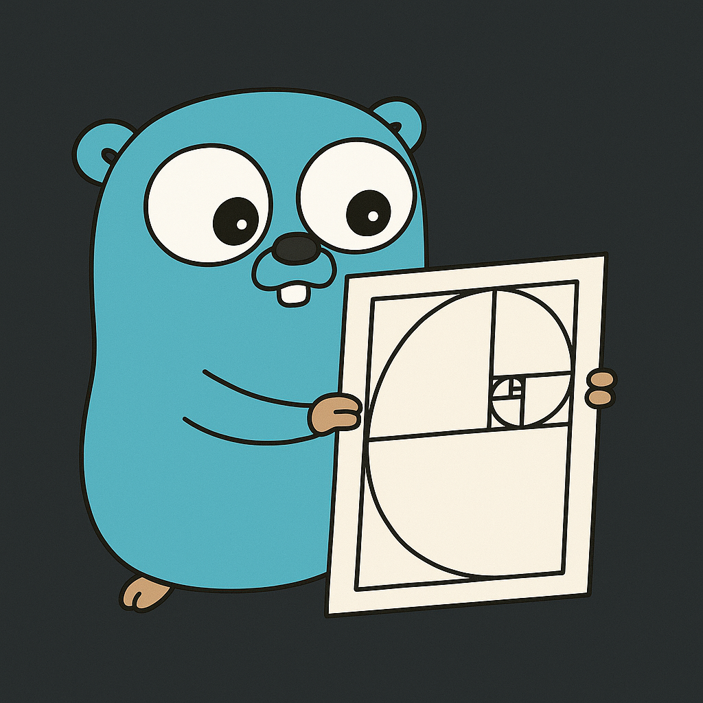

# Программа для вычисления чисел Фибоначчи



Этот код позволяет вычислить [числа Фибоначчи](https://ru.wikipedia.org/wiki/%D0%A7%D0%B8%D1%81%D0%BB%D0%B0_%D0%A4%D0%B8%D0%B1%D0%BE%D0%BD%D0%B0%D1%87%D1%87%D0%B8) через рекурсию с мемоизацией `fibo.CalcRecursive`, через итерационный цикл `fibo.CalcIterative` и по формуле Бине `fibo.CalcBinet`.

```txt
❯ ./fibo
Program for calculating Fibonacci numbers
Enter a number [or any to complete]: 42
[Recursive] Fibonacci(42) = 267914296
[Iterative] Fibonacci(42) = 267914296
[Binet] Fibonacci(42) = 267914296
```

#### Запустить программу

```shell
go run .
```

#### Запустить тесты

```shell
go test . -v
```

#### Запустить бенчмарки

```shell
go test --bench .
```

#### Собрать исполняемый файл

```shell
go build .
```

#### Запустить исполняемый файл

```shell
./fibo
```
